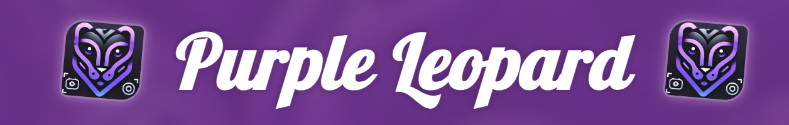
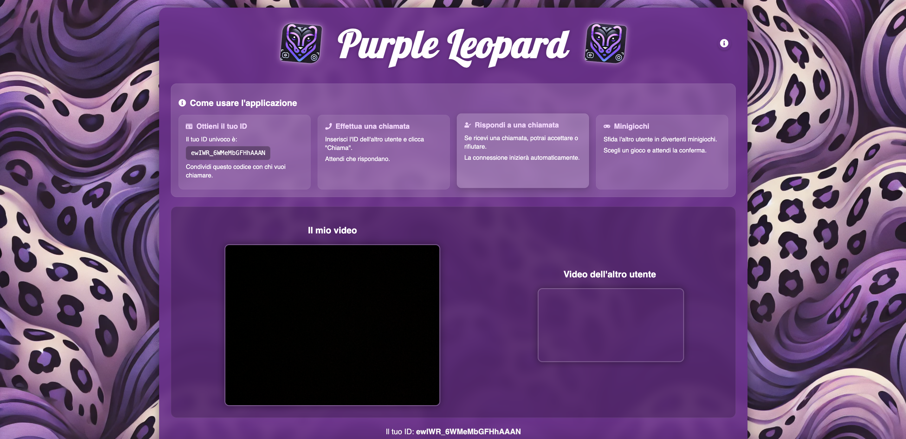
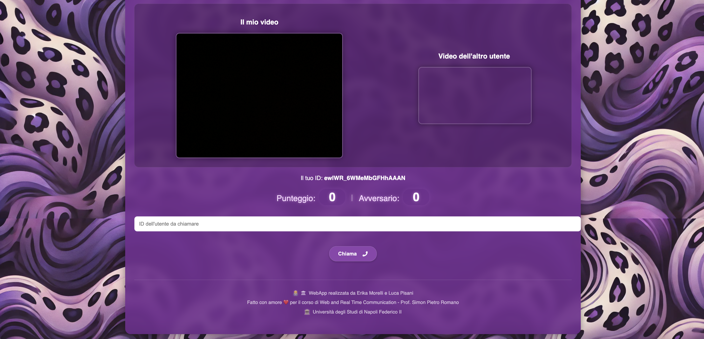
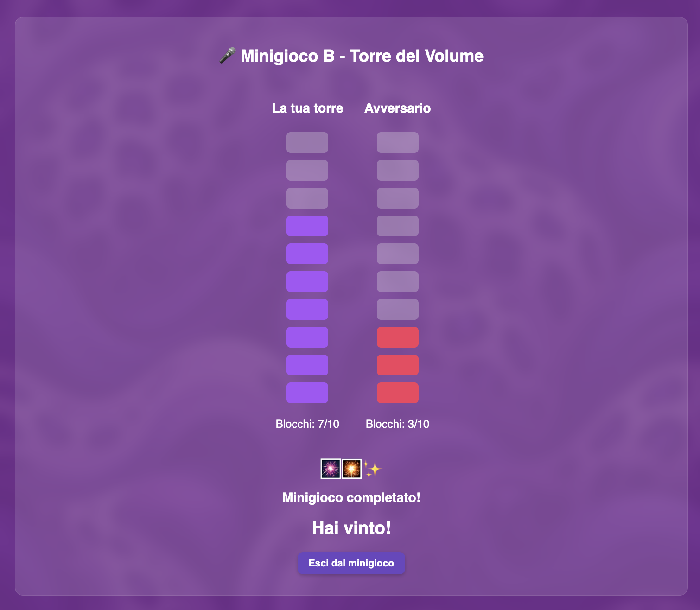

# WebRTC_Mini_Games
Una web app di minigiochi in tempo reale, sviluppata con React, WebRTC e Node.js

---



Un'applicazione web innovativa che unisce **videochiamate in tempo reale** e **minigiochi multiplayer**. Costruita con **React**, **WebRTC** e **Node.js**, consente a due utenti di connettersi tramite video e sfidarsi in **3 minigiochi interattivi**.

---

## 🚀 Caratteristiche principali

- ✅ Videochiamata peer-to-peer via WebRTC
- 🎲 Minigiochi integrati in tempo reale
- 🧠 Punteggi aggiornati live e visibili a entrambi i giocatori
- 🌐 Interfaccia moderna e responsive con React
- 🧩 Backend real-time con Node.js & WebSocket

---

## 🖼️ Interfaccia dell'app

### 📺 Schermata principale

<div style="display: flex; gap: 10px;">
  
  
</div>

---

## 🕹️ Minigiochi disponibili

### 🧠 Memory

> Trova le coppie più velocemente dell'avversario!


---

### 🗼 Torre del Volume

> Sfida di precisione: accumula blocchi senza far crollare la torre!



---

### 🤠 Duello Far West

> Chi ha il riflesso più veloce? Spara prima del tuo avversario!


---

## 🛠️ Tech Stack

- **Frontend:** React + WebRTC
- **Backend:** Node.js + WebSocket
- **Styling:** CSS
- **Deployment:** Ngrok

---

## 📦 Installazione

```bash
git clone https://github.com/WebRTC-Projects-Unina/WebRTC_Mini_Games.git
cd WebRTC_Mini_Games.git
npm install (./frontend)
npm install (./backend)
npm run build (frontend)
-- in caso di errore vite lanciare il comando: npm install vite
node server.js (backend)
```
In caso si volesse testare la comunicazione tra dispositivi differenti è possibile usare il servizio ngrok:
1. Registrarsi al sito ed ottenere il proprio token di configurazione
2. Configurare ngrok con le proprie credenziali sul proprio sistema (sul quale il server verrà avviato)
3. Lanciare il file ngrok.exe presente nella directory ../backend/ del progetto
4. Lanciare il comando: ngrok http 4000
5. Diffondere il link di reindirizzamento fornito dal servizio ngrok avviato

In caso di erorri o problemi con i moduli node si consiglia di eliminare le cartelle node modules e rilanciare i comandi npm install
---

## ✨ Autore

Sviluppato con ❤️ da Erika Morelli e Luca Pisani
---

## Documentazione
E' possibile consultare il file docPurpleLeopard.pdf per ulteriori informazioni sul progetto!
