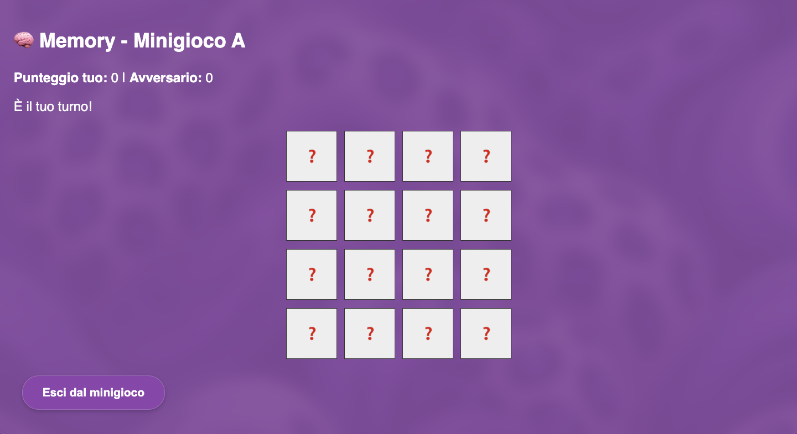

# WebRTC_Mini_Games
Una web app di minigiochi in tempo reale, sviluppata con React, WebRTC e Node.js

---


Un'applicazione web innovativa che unisce **videochiamate in tempo reale** e **minigiochi multiplayer**. Costruita con **React**, **WebRTC** e **Node.js**, consente a due utenti di connettersi tramite video e sfidarsi in **3 minigiochi interattivi**.

---

## 🚀 Caratteristiche principali

- ✅ Videochiamata peer-to-peer via WebRTC
- 🎲 Minigiochi integrati in tempo reale
- 🧠 Punteggi aggiornati live e visibili a entrambi i giocatori
- 🌐 Interfaccia moderna e responsive con React
- 🧩 Backend real-time con Node.js & WebSocket

---

## 🖼️ Interfaccia dell'app

### 📺 Schermata principale

<div style="display: flex; gap: 10px;">
  
  
</div>

---

## 🕹️ Minigiochi disponibili

### 🧠 Memory

> Trova le coppie più velocemente dell'avversario!



---

### 🗼 Torre del Volume

> Sfida di precisione: accumula blocchi senza far crollare la torre!


---

### 🤠 Duello Far West

> Chi ha il riflesso più veloce? Spara prima del tuo avversario!


---

## 🛠️ Tech Stack

- **Frontend:** React + WebRTC
- **Backend:** Node.js + WebSocket
- **Styling:** CSS
- **Deployment:** Ngrok

---

## 📦 Installazione

```bash
git clone https://github.com/WebRTC-Projects-Unina/WebRTC_Mini_Games.git
cd WebRTC_Mini_Games.git
npm install
npm run build (frontend)
node server.js (backend)
```

---

## ✨ Autore

Sviluppato con ❤️ da Erika Morelli e Luca Pisani
